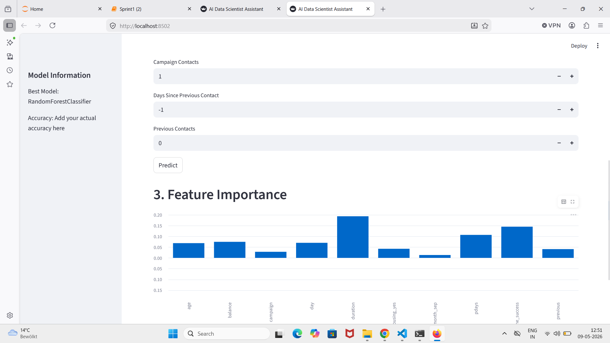
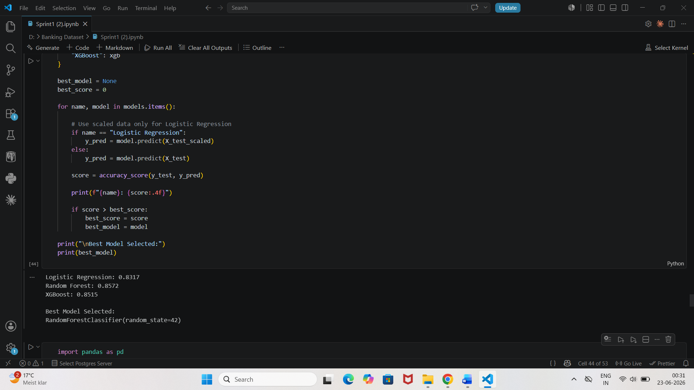
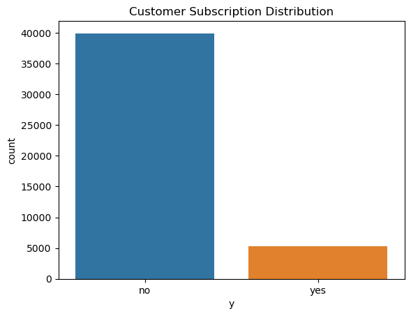

## Project Workflow

Dataset
↓

Preprocessing

↓

Model Training

↓

Best Model Selection

↓

Prediction

↓

Feature Importance

↓

AI Assistant (Gemini API)
# AI-Data-Scientist-Assistant-using-LLMs-and-AutoML.

## Dataset Upload

---

## Feature Importance

---

## Prediction

---

## Model Output

## AI Assistant

## Technologies Used

- Python
- Streamlit
- Scikit-Learn
- XGBoost
- Random Forest
- Pandas
- NumPy
- Plotly
- Google Gemini API

---

